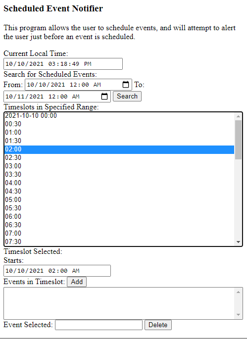

Scheduled Event Notifier
========================

The JavaScript code in this repository partially implements a program that allows the user to schedule events into a calendar and then receive some form of reminder notification some period of time before they occur.

As of this writing, it is a work in progress.

